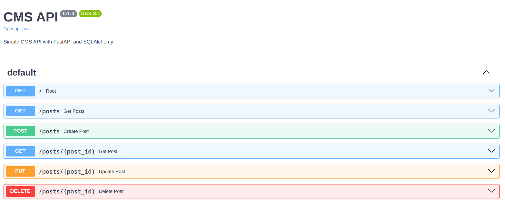
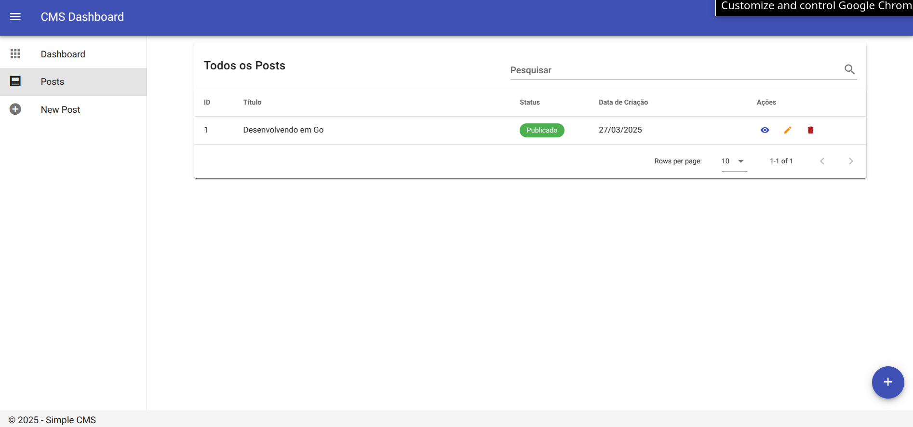
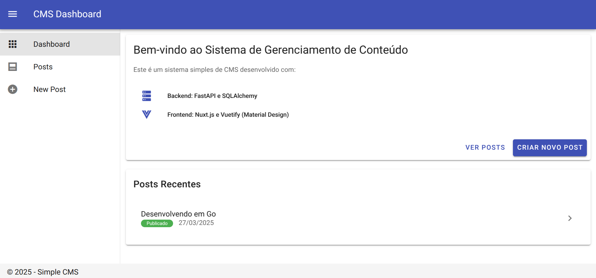
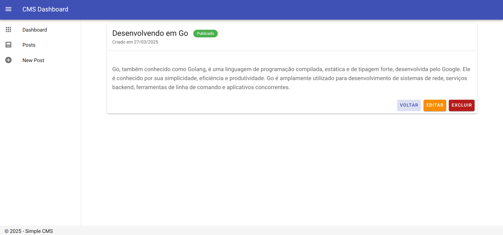
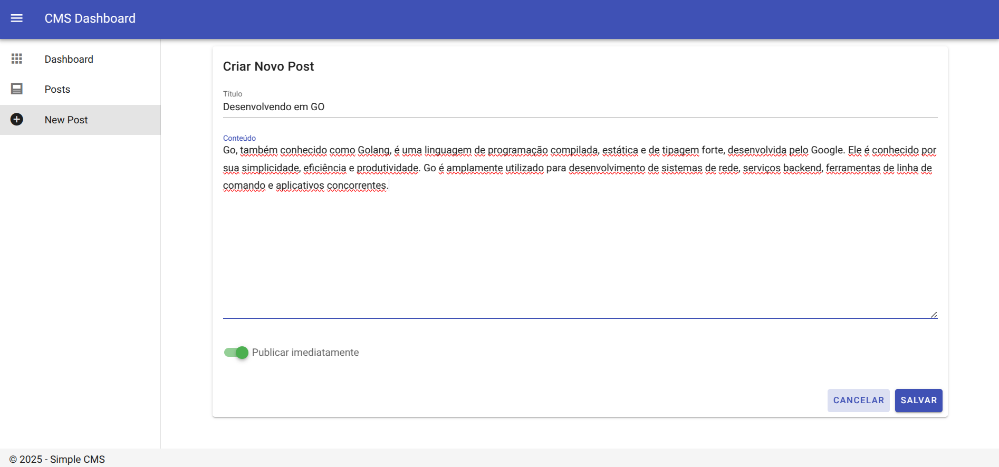

# Sistema de Gerenciamento de Conteúdo (CMS)

Um sistema simples de CMS com backend em FastAPI e frontend em Nuxt.js com Material UI.

## Estrutura do Projeto

### 🧰 Tecnologias

#### Backend


#### Frontend


## Requisitos

- 
- 


## Executando com Docker

Para executar todo o projeto usando Docker Compose:

```bash
# Construir e iniciar os contêineres
docker-compose up --build
#Depois de Construido
docker-compose up #desenvolvimento
```

Após a inicialização, você pode acessar:

- **Frontend**: http://localhost:3000
- **API Backend**: http://localhost:8000
- **Documentação da API**: http://localhost:8000/docs

## Desenvolvimento Local

### Backend

```bash
# Instalar dependências
pip install -r requirements.txt

# Executar servidor de desenvolvimento
uvicorn main:app --reload
```

### Frontend

```bash
# Navegar para a pasta do frontend
cd frontend

# Instalar dependências
npm install

# Executar servidor de desenvolvimento
npm run dev
```

## ✨ Funcionalidades

- Criar, listar, visualizar, editar e excluir posts
- Interface de usuário moderna e responsiva com Material Design

  

  
- API RESTful documentada com Swagger
-  Persistência de dados

## 📄 Licença

MIT License - Consulte o arquivo [LICENSE](LICENSE) para detalhes
